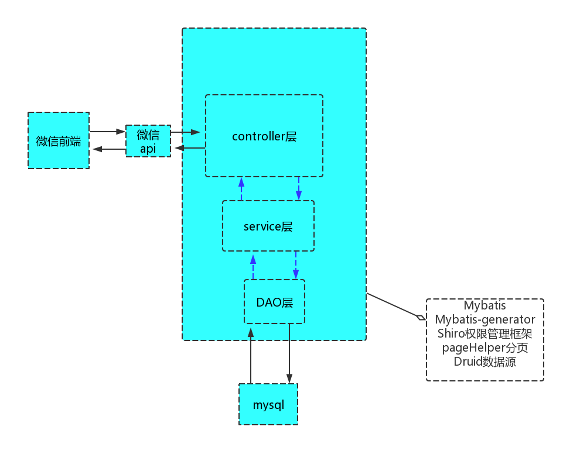
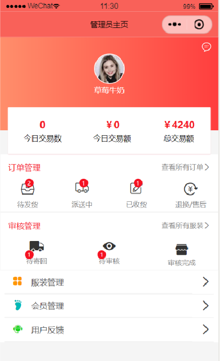
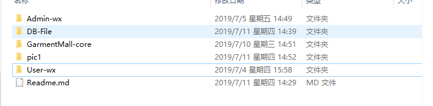
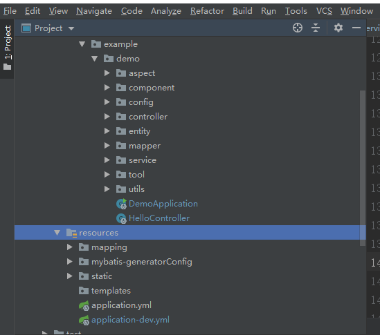

# 1 GarmentMall系统

## 1.1 简介

GarmentMall是一个简单的会员制服装管理系统，包括管理员微信端，用户微信端以及基于spring boot的后端。

    


项目的架构是SpringBoot+Mybatis+微信小程序

* 图片展示：

	* 用户前端
   

	* 管理员后端
    
	


后端技术栈：

* 数据库：Mysql

* 数据源：Druid ，Druid是阿里巴巴开发为监控而生的数据库连接池，它结合了C3P0、DBCP、PROXOOL等DB池的优点

* Mybatis-generator：用于生成DAO层接口

* Mybatis-pagehelper：用于分页请求

* 用AOP（面向切面）功能来打印日志

### 1.1.1 项目特点

项目存在以下特点：

* 数据库方面，只是简单的表，表和表之间的依赖关系没有采用外键设计，而是依赖Java代码在service层面或者业务层面保证。这样做的好处是数据库频繁改动很方便，不会因为外键而导致数据库难以修改;
* 涉及两种技术栈，但是每种技术栈仅涉及最基础的技术；
  * 后端技术栈，仅涉及 Spring，Spring Boot, Spring MVC和Mybatis技术，其他后端技术暂时不采用;
  * 小程序技术栈，仅涉及miniprogram官方文档；
  * 
* 安全方面，仅采用最基本的代码，提供简单基本的安全服务;
* 性能方面，没有涉及内存数据库缓存功能，而是完全依赖MySQL，以及Druid数据源;
* 对象存储服务方面，支持本地存储。
* 

总之，目前的系统只是为了学习技术和业务而开发的一个简单商场原型系统。虽然缺失很多企业级功能，但是是完整和合理的原型系统。

注意：
> 以上特点并不一定是优点。

## 1.2 系统功能

从业务功能上，目前由五个业务模块组成：

* 会员业务模块
* 商场业务模块
* 商品业务模块
* 推荐业务模块
* 系统业务模块


### 1.2.1 小商城功能

* 首页
* 分类列表、分类详情
* 品牌列表、品牌详情
* 新品首发、人气推荐
* 商品详情
* 购物车
* 下单
* 个人
* 订单列表、订单详情
* 地址列表、地址添加、地址删除
* 收藏、关于


### 1.2.3 管理平台功能

* 会员管理
  * 会员管理
  * 会员收藏
  * 意见反馈
* 商城管理
  * 订单管理
  * 商品类目
  * 通用问题
* 商品管理
  * 商品列表
  * 商品上架
  * 商品编辑
  * 用户评论
* 推广管理(待开发)
  * 广告管理
  * 专题管理
  * 团购规则
  * 团购活动
* 系统管理(dai)
  * 管理员
  * 对象存储
  * 权限管理 （待开发
  * 定时任务（待定）
  * 操作日志


## 1.3 项目技术

### 1.3.1 技术参考

#### 1.3.1.1 Spring Boot技术

Spring Boot技术栈参考以下文档或者项目：

1. MySQL

   了解创建数据库和表、添加、查询、更新和删除即可。
    
2. Spring Boot 2.x

    * https://docs.spring.io/spring-boot/docs/2.1.5.RELEASE/reference/htmlsingle/#getting-started-introducing-spring-boot
    * https://docs.spring.io/spring-boot/docs/2.1.5.RELEASE/reference/htmlsingle/#using-boot-maven

    这里需要了解RestController, Service等注解，以及如何使用自动化配置。 
    Spring Boot支持很多功能，开发者使用时查阅。
    
3. Mybatis

    * http://www.mybatis.org/mybatis-3/
    * http://www.mybatis.org/mybatis-3/java-api.html
    * http://www.mybatis.org/mybatis-3/sqlmap-xml.html
 
    这里可以简单了解，而使用Mybatis Generator来生成Java代码使用即可。
    
4. Mybatis Generator

    * http://www.mybatis.org/generator/running/runningWithMaven.html
    * http://www.mybatis.org/generator/generatedobjects/results.html
    * http://www.mybatis.org/generator/generatedobjects/exampleClassUsage.html
    
5. Mybatis PageHelper

    * https://github.com/pagehelper/Mybatis-PageHelper/blob/master/wikis/en/HowToUse.md
    
#### 1.3.1.2 小程序技术

1. 小程序

    * https://developers.weixin.qq.com/miniprogram/dev/index.html
    * https://developers.weixin.qq.com/miniprogram/dev/component/
    * https://developers.weixin.qq.com/miniprogram/dev/api/
    * https://developers.weixin.qq.com/community/develop
    
    建议小程序方面遇到问题，可以到官方社区查找。


### 1.4.1 数据库

数据库环境设置过程如下：

1. 安装MySQL;

2. 创建数据库、用户权限、数据库表和测试数据;
   数据库测试文件存放在 文件夹中，导入至Mysql
  


### 1.4.2 Spring Boot开发环境

推荐IDEA编辑器

### 1.4.3 微信小程序开发环境

微信开发者工具

## 1.2 系统详细说明


###1.2.1 文档结构

   

* Admin-wx：管理员微信端
* User-wx ：用户微信端
* DB-file：数据库文件
* GarmentMall-core ：springboot项目后端


   
* demo
 * aspect:：基于AOP实现日志记录
 * config：配置文件，包括Druid数据源配置，pagehelper插件配置，以及本地存储文件映射。
 * controller：所有的对外接口在这里，也作为日志打印的切面
 * entity：实体类
 * mapper：DAO层接口
 * service：业务逻辑层（其实写到后面，service层与controller层职责已经写乱了 ：））
 * utils：工具包，用于文件上传以及生成随机的文件名 
 *
* resources
	* mapping ：DAO层接口的实现
	* mybatis-generatorConfig：看文件名就知道了
	* static：静态文件，包括图片啊，html
	* templates：好像是模板类，但html文件放在这下面访问的是63342端口，why？
	* application：总配置文件，用于选择测试版本还是发布版本
	* application-dev：测试版本，包括数据源配置，mybatis配置

##1.3 项目中遇到的问题
### 1.3.1 Mybatis-generator
当你已经生成好entity，mapper，mapping文件后，数据库如果要新增字段或者表时，要把mapping下面的xml文件删除，否则会导致代码的崩溃

###1.3.2 Druid
配置好Druid数据源后，可进入 http://localhost:8080/druid 进入监控页面，但要在项目启动类上加上@ServletComponentScan
原因：druid监控页面是一个servlet
```
@SpringBootApplication
@ServletComponentScan
@MapperScan("com.example.demo.mapper")
@EnableScheduling
public class DemoApplication {

    public static void main(String[] args) {
 	TimeZone.setDefault(TimeZone.getTimeZone("GMT+8"));
        SpringApplication.run(DemoApplication.class, args);
    }

}
```
### 1.3.3 图片上传

发送端发送本地图片，服务端接收，需要为图片生成随机ID，然后将id存入数据库，然后配置映射来给发送端访问（回显），如果是放置在项目的static文件夹下，项目需要重启才能访问新上传的图片，所以要在config里面配置本地存储位置：
```
@Configuration
public class WebMvcConfig implements WebMvcConfigurer {

    @Override
    public void addResourceHandlers(ResourceHandlerRegistry registry) {
        registry.addResourceHandler("/**").addResourceLocations("classpath:/static/");

       registry.addResourceHandler("/**").addResourceLocations("file:D:/image/");
    }

}
```
### 1.3.4 微信端API

项目并没有发布，测试接口是通过连接手机wifi来实现不同主机之间的接口测试，所以在微信小程序中需要改ip地址：（可用 ”ipconfig“ 来查看本机ip地址）
   *  在admin-wx中修改config/api.js  中的prefix 
   *  在user-wx中修改app.js 中的serverUrl
    
